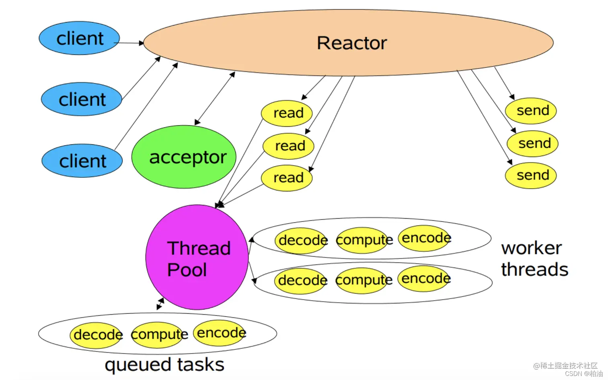
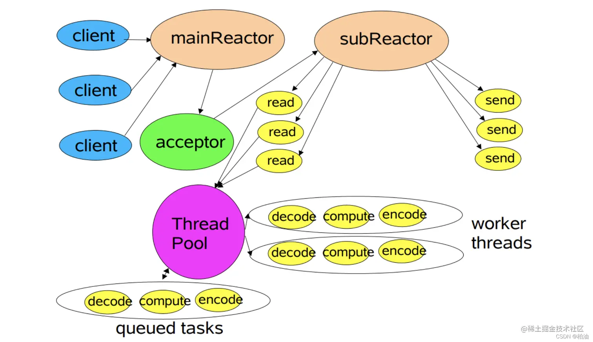

# muduo-demo

Implement the Muduo network library

## 网络 IO 阶段一

### 数据准备:阻塞和非阻塞

代码案例：

```c++
ssize_t recv(int sockfd,void *buf,size_t len,int flags);
int size=recv(sockfd,buf,1024,0);
return:
  size == -1 :远端断开连接
  size == -1 && error== EAGAIN  :表示当sockfd设置成非阻塞时，没有网络事件的发生
  size == 0  :表示对端关闭连接
  size > 0 :表示有数据到来
```

阻塞：
如果用户发起了读写请求，内核态一直阻塞用户操作，直到内核态数据完全准备就绪，才返回，这种方式称之为阻塞 IO

sockfd 会一直阻塞，等待数据的到来
调用 IO 方法的线程进入阻塞状态

非阻塞：
如果用户发起了读写请求，但内核态数据还未准备就绪，不会阻塞用户操作，内核立马返回，称为非阻塞 IO

recv 会直接返回，不会阻塞该线程
不会改变线程的状态，通过返回值判断

## 网络 IO 阶段二

强调 IO 的同步和异步

### 数据的读写:同步 IO 和异步 IO

同步 IO：

- 定义:​ 用户进程发出 IO 调用，去获取 IO 设备数据，双方的数据要经过内核缓冲区同步，完全准备好后，再复制返回到用户进程。 而复制返回到用户进程会导致请求进程阻塞，直到 I/O 操作完成。

同步 IO 举例：recv 函数

异步 IO:

​- 定义:用户进程发出 IO 调用，去获取 IO 设备数据，并不需要同步，内核直接复制到进程，整个过程不导致请求进程阻塞。

异步 IO 举例：在读取数据缓存区的同时，将数据 cpoy 到 buff，通过 signal 信号、回调函数通知，就已经完成了

## Unix/Linux 上的五种 IO 模型

### 阻塞 blocking

read

### 非阻塞 no blocking

read sockfd 设置为非阻塞

### IO 复用 multiplexing

epoll、poll、select(非阻塞同步)

### 信号驱动 signal-driven

在数据准备阶段是异步的，在数据读取阶段是同步的，与非阻塞 IO 相比的区别在于它提供了消息通知机制，不需要用户轮询检查

### 异步 asynchronous

```c++
struct aiocb{
  int               aio_fildes
  off_t             aio_offset
  volatile void    *aio_buf
  size_t            aio_nbytes
  int               aio_reqprio
  struct  sigevent  aio_lio_opcode
}
```

## Reactor 模型

Reactor 模式由 Reactor 线程、Handlers 处理器两大角色组成，两大角色的职责分别如下：

- Reactor 线程的职责：主要负责连接建立、监听 IO 事件、IO 事件读写以及将事件分发到 Handlers 处理器。
  Handlers 处理器（业务处理）的职责：非阻塞的执行业务处理逻辑。

### 单线程模型


上图描述了 Reactor 的单线程模型结构，在 Reactor 单线程模型中，所有 I/O 操作（包括连接建立、数据读写、事件分发等）、业务处理，都是由一个线程完成的。单线程模型逻辑简单，缺陷也十分明显：

一个线程支持处理的连接数非常有限，CPU 很容易打满，性能方面有明显瓶颈；

当多个事件被同时触发时，只要有一个事件没有处理完，其他后面的事件就无法执行，这就会造成消息积压及请求超时；

线程在处理 I/O 事件时，Select 无法同时处理连接建立、事件分发等操作；

如果 I/O 线程一直处于满负荷状态，很可能造成服务端节点不可用。

在单线程 Reactor 模式中，Reactor 和 Handler 都在同一条线程中执行。这样，带来了一个问题：当其中某个 Handler 阻塞时，会导致其他所有的 Handler 都得不到执行。
在这种场景下，被阻塞的 Handler 不仅仅负责输入和输出处理的传输处理器，还包括负责新连接监听的 Acceptor 处理器，可能导致服务器无响应。这是一个非常严重的缺陷，导致单线程反应器模型在生产场景中使用得比较少。

### 多线程模型


由于单线程模型有性能方面的瓶颈，多线程模型作为解决方案就应运而生了。

Reactor 多线程模型将业务逻辑交给多个线程进行处理。除此之外，多线程模型其他的操作与单线程模型是类似的，比如连接建立、IO 事件读写以及事件分发等都是由一个线程来完成。

当客户端有数据发送至服务端时，Select 会监听到可读事件，数据读取完毕后提交到业务线程池中并发处理。

一般的请求中，耗时最长的一般是业务处理，所以用一个线程池（worker 线程池）来处理业务操作，在性能上的提升也是非常可观的。

当然，这种模型也有明显缺点，连接建立、IO 事件读取以及事件分发完全有单线程处理；比如当某个连接通过系统调用正在读取数据，此时相对于其他事件来说，完全是阻塞状态，新连接无法处理、其他连接的 IO 查询/IO 读写以及事件分发都无法完成。
对于像 Nginx、Netty 这种对高性能、高并发要求极高的网络框架，这种模式便显得有些吃力了。因为，无法及时处理新连接、就绪的 IO 事件以及事件转发等。
接下来，我们看看主从多线程模型是如何解决这个问题的。

### 主从多线程模型


在多线程模型中，我们提到，其主要缺陷在于同一时间无法处理大量新连接、IO 就绪事件；因此，将主从模式应用到这一块，就可以解决这个问题。
主从 Reactor 模式中，分为了主 Reactor 和 从 Reactor，分别处理 新建立的连接、IO 读写事件/事件分发。

一来，主 Reactor 可以解决同一时间大量新连接，将其注册到从 Reactor 上进行 IO 事件监听处理
二来，IO 事件监听相对新连接处理更加耗时，此处我们可以考虑使用线程池来处理。这样能充分利用多核 CPU 的特性，能使更多就绪的 IO 事件及时处理。

简言之，主从多线程模型由多个 Reactor 线程组成，每个 Reactor 线程都有独立的 Selector 对象。MainReactor 仅负责处理客户端连接的 Accept 事件，连接建立成功后将新创建的连接对象注册至 SubReactor。再由 SubReactor 分配线程池中的 I/O 线程与其连接绑定，它将负责连接生命周期内所有的 I/O 事件。
在海量客户端并发请求的场景下，主从多线程模式甚至可以适当增加 SubReactor 线程的数量，从而利用多核能力提升系统的吞吐量。

## 多路 IO 复用模型

数据准备阶段由内核准备好，再由应用层读取数据

### select

优点:
跨平台

缺点:
文件描述符 1024 的限制，由于 FD_SETSIZE 的限制
每次都需要将需要监听的文件描述符集合由应用层符拷贝到内核

### poll

优点:
没有 1024 的限制
请求返回
