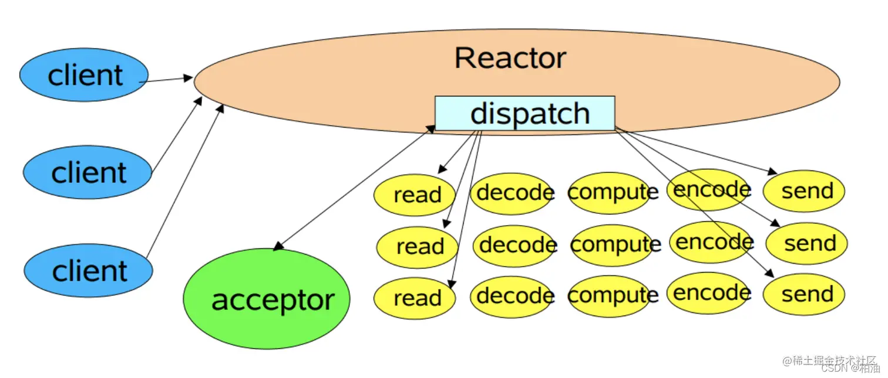

# muduo-demo

Implement the Muduo network library

## 网络 IO 阶段一

### 数据准备:阻塞和非阻塞

代码案例：

```c++
ssize_t recv(int sockfd,void *buf,size_t len,int flags);
int size=recv(sockfd,buf,1024,0);
return:
  size == -1 :远端断开连接
  size == -1 && error== EAGAIN  :表示当sockfd设置成非阻塞时，没有网络事件的发生
  size == 0  :表示对端关闭连接
  size > 0 :表示有数据到来
```

阻塞：
如果用户发起了读写请求，内核态一直阻塞用户操作，直到内核态数据完全准备就绪，才返回，这种方式称之为阻塞 IO

sockfd 会一直阻塞，等待数据的到来
调用 IO 方法的线程进入阻塞状态

非阻塞：
如果用户发起了读写请求，但内核态数据还未准备就绪，不会阻塞用户操作，内核立马返回，称为非阻塞 IO

recv 会直接返回，不会阻塞该线程
不会改变线程的状态，通过返回值判断

## 网络 IO 阶段二

强调 IO 的同步和异步

### 数据的读写:同步 IO 和异步 IO

同步 IO：

​ 用户进程发出 IO 调用，去获取 IO 设备数据，双方的数据要经过内核缓冲区同步，完全准备好后，再复制返回到用户进程。 而复制返回到用户进程会导致请求进程阻塞，直到 I/O 操作完成。

同步 IO 举例：recv 函数

异步 IO:

​ 用户进程发出 IO 调用，去获取 IO 设备数据，并不需要同步，内核直接复制到进程，整个过程不导致请求进程阻塞。

异步 IO 举例：在读取数据缓存区的同时，将数据 cpoy 到 buff，通过 signal 信号、回调函数通知，就已经完成了

## Unix/Linux 上的五种 IO 模型

### 阻塞 blocking

read

### 非阻塞 no blocking

read sockfd 设置为非阻塞

### IO 复用 multiplexing

epoll、poll、select(非阻塞同步)

### 信号驱动 signal-driven

在数据准备阶段是异步的，在数据读取阶段是同步的，与非阻塞 IO 相比的区别在于它提供了消息通知机制，不需要用户轮询检查

### 异步 asynchronous

```c++
struct aiocb{
  int               aio_fildes
  off_t             aio_offset
  volatile void    *aio_buf
  size_t            aio_nbytes
  int               aio_reqprio
  struct  sigevent  aio_lio_opcode
}
```

## Reactor 模型

Reactor 模式由 Reactor 线程、Handlers 处理器两大角色组成，两大角色的职责分别如下：

Reactor 线程的职责：主要负责连接建立、监听 IO 事件、IO 事件读写以及将事件分发到 Handlers 处理器。
Handlers 处理器（业务处理）的职责：非阻塞的执行业务处理逻辑。

### 单线程模型


